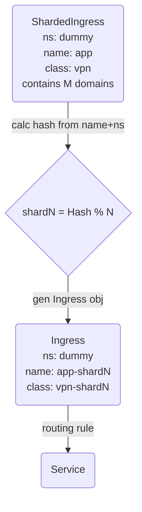
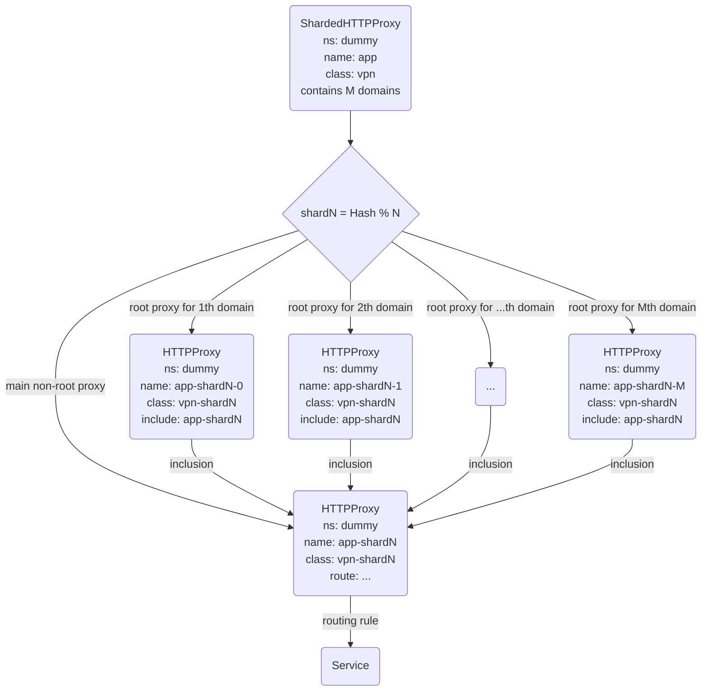

## Создание шардов для Ingress

```mermaid
flowchart TD
    A("ShardedIngress
    ns: dummy
    name: app
    class: vpn
    contains M domains") --> |"calc hash from name+ns"| B{"shardN = Hash % N"}
    B --> |"gen Ingress obj"| C("Ingress
    ns: dummy
    name: app-shardN
    class: vpn-shardN")
    C --> |"routing rule"| S(Service)
```

## Создание шардов для HTTPProxy

```mermaid
flowchart TD
    A("ShardedHTTPProxy
    ns: dummy
    name: app
    class: vpn
    contains M domains") --> B{"shardN = Hash % N"}
    B --> |"main non-root proxy"| C("HTTPProxy
    ns: dummy
    name: app-shardN
    class: vpn-shardN
    route: ...")
    B --> |"root proxy for 1th domain"| D("HTTPProxy
    ns: dummy
    name: app-shardN-0
    class: vpn-shardN
    include: app-shardN")
    B --> |"root proxy for 2th domain"| F("HTTPProxy
    ns: dummy
    name: app-shardN-1
    class: vpn-shardN
    include: app-shardN")
    B --> |"root proxy for ...th domain"| N("...")
    B --> |"root proxy for Mth domain"| M("HTTPProxy
    ns: dummy
    name: app-shardN-M
    class: vpn-shardN
    include: app-shardN")
    D --> |"inclusion"| C
    F --> |"inclusion"| C
    N --> |"inclusion"| C
    M --> |"inclusion"| C
    C --> |"routing rule"| S(Service)
```
